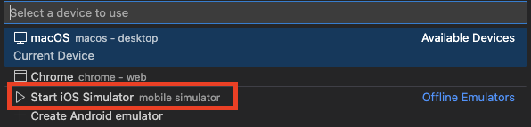

# Ferum mobile app

## Getting Started

Ce document explique les étapes nécessaires afin de lancer l’application Flutter localement.

### Installation de l'environnement de développement

#### Téléchargement des logiciels prérequis

Installer **Xcode**.

```bash
xcode-select --install
```

Puis, accepter les licences.

```bash
sudo xcodebuild -license
```

Télécharger **Visual Studio Code** et ajouter l'extension **Flutter**.

Installer **CocoaPods** (gestionnaire de dépendances IOS).

```bash
sudo gem install cocoapods
# ou
brew install cocoapods
```

Si vous êtes sur un Mac **Apple Silicon (ARM)**, installer Rosetta.

```bash
sudo softwareupdate --install-rosetta --agree-to-license
```

#### Installation et mise en place de Flutter

Installer **Flutter** en suivant le [tutoriel officiel](https://docs.flutter.dev/install/with-vs-code#install-flutter)

**Important: pensez à ajouter Flutter au PATH de votre système.**

Vérifier l'installation : 

```bash
flutter doctor
```

Corriger les éventuelles erreurs affichées.

### Mise en place de l'environnement de développement IOS

Installer le simulateur IOS.

```bash
xcodebuild -downloadPlatform iOS
```

Documentation : [tutoriel officiel](https://docs.flutter.dev/platform-integration/ios/setup#set-up-tooling).

### Récupération du projet

Cloner le repository et se déplacer dans le dossier.

```bash
git clone URL
cd repo
```

### Installation des dépendances

Cela se fait automatiquement lors du lancement de `main.dart`.
Cependant, vous pouvez le faire manuellement:

```bash
flutter pub get 
```

### Lancement du projet

Depuis VS Code :
- En bas à droite de l'écran, choisir l'appareil cible (Start iOS Simulator), par défaut, il est écris `macos`.

- Exécuter le fichier main.dart

Depuis le terminal :

```bash
open -a Simulator
flutter run
```

### Dépannage (tips rapides)

Si le build échoue après modification des dépendances :

```bash
flutter clean
flutter pub get
```

Si CocoaPods manque dans iOS :

```bash
cd ios
pod install
```

Si le simulateur ne démarre pas :

```bash
open -a Simulator
```

### Réinitiliasation application

Afin de réinitialiser l'application local, donc de supprimer les préférences, il est nécessaire de supprimer l'application de l'iPhone.

Pour cela, rendez-vous sur l'écran d'accueil de l'iPhone et appuiez longuement sur l'app jusqu'à ce que le bouton supprimer l'application apparaisse.

### Modification URL backend

Par défaut, sur la branche `main`, le backend hébergé sur infomaniak est configuré.

Afin de modifier l'URL du backend sur laquelle vous souhaitez vous connecter, allez dans dans le fichier [lib/utils/sharedPreferences.dart](./lib/utils/sharedPreferences.dart) et modifier la propriété `BackendURLs`.

```dart
await prefs.setString('BackendURL', 'http://127.0.0.1:8080');
```

Si vous exécutez le backend en local, utilisez l'URL `http://127.0.0.1:8080`. Si vous souhaitez utiliser le backend hébergé sur infomaniak vous devez mettre `http://83.228.200.235`.

### Import d'entrainement effectué

Afin d'importer un entrainement effectué, vous pouvez aller directement dans Apple Santé sur l'iOS Simulator et rajouter des données manuellement.

Autrement, vous pouvez importer un workout en vous connectant directement à l'API.

Vous trouverez des exemples des payloads ainsi que les explications pour utiliser l'API dans le [repository du backend](https://github.com/ferum-pdg/backend-api).